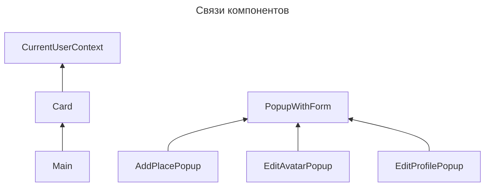
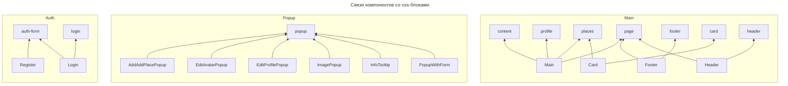

# 1 Задание

### Уровень 1. Проектирование

Предположим, что нам нужно разгрузить команду фронтенда, и добавить еще одну команду (или две).  
Для этого будем распиливать фронт на "независимые" модули.  

**Выбираем Webpack — Module Federation**  
Поскольку фронтенд уже написан, и он весь на Реакте.
Других js-фреймворков в проекте нет, поэтому удобнее испльзовать Webpack — Module Federation.

### Уровень 2. Планирование изменений

#### Пробуем нащупать границы и связанность компонентов.  
`App` зависит от всех. Это что-то такое объединяющее.
Остальные компоненты выглядят практически независимыми, только вокруг Popup заметны некоторые объединения.

копаем дальше...

#### Пробуем определить связанность компонентов через переиспользование CSS-блоков 

Тут наблюдаем четкие границы между тремя группами.

Предлагаю таким образом и разделить приложение на микрофронтенды:
- microfrontend_core
- microfrontend_popup
- microfrontend_auth

Текущая фронтенд-команда продолжит работать с `microfrontend_core`, это пока самый крупный микрофронтенд.  
А команда, которая пришла на помощь, будет работать с `microfrontend_popup`, `microfrontend_auth`. 
А потом, возможно, и другими новыми микрофронтендами.

# 2 Задание

[Схема микросервисов на draw.io](https://drive.google.com/file/d/1y9ro_KpfNJT_QUIIQTd7vKhqX3ZWilqQ/view?usp=sharing)